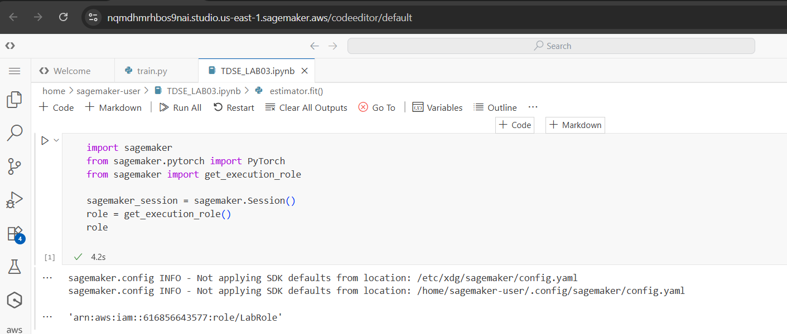
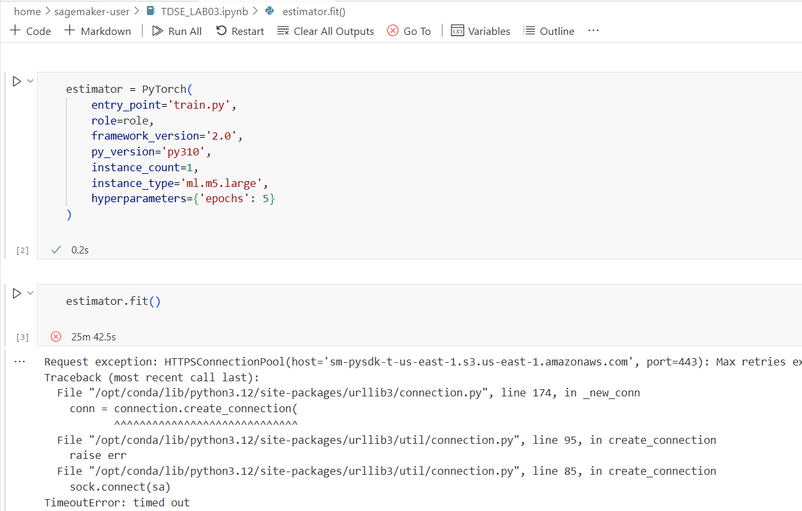

# Exploring Convolutional Layers Through Data and Experiments

## Problem Description

Neural networks are not treated as black boxes in this project, but as architectural systems whose design choices directly influence learning behavior, performance, and interpretability.

The objective of this assignment is to explore **convolutional layers** as a concrete example of how inductive bias is introduced into neural network design. Through dataset exploration, baseline comparison, architectural reasoning, and controlled experiments, this project analyzes why convolutional neural networks are particularly effective for image-based data.

---

## Dataset Description

### Selected Dataset: Fashion-MNIST

Fashion-MNIST is a public image dataset consisting of grayscale images of clothing items. It serves as a drop-in replacement for the original MNIST dataset, offering more complex visual patterns while remaining computationally lightweight.

**Key characteristics:**
- Total samples: 70,000
  - Training set: 60,000 images
  - Test set: 10,000 images
- Image size: 28 × 28 pixels
- Channels: 1 (grayscale)
- Number of classes: 10
- Dataset balance: Uniform distribution across classes

### Why this dataset is appropriate for convolutional layers

Fashion-MNIST contains strong spatial patterns such as edges, contours, and textures. These local correlations between neighboring pixels make the dataset well-suited for convolutional architectures, which exploit spatial locality through local receptive fields and weight sharing.

---

## Exploratory Data Analysis (EDA)

The EDA focuses on understanding the structure of the dataset rather than exhaustive statistics:

- Verified dataset size and class balance
- Inspected image dimensions and channel structure
- Visualized representative samples from each class
- Applied normalization to scale pixel values for stable training

Visual inspection confirms that meaningful spatial features are present, justifying the use of convolutional layers over fully connected models.

---

## Baseline Model (Non-Convolutional)

### Architecture

The baseline model is a fully connected neural network (MLP) composed of:

Input (28×28)
→ Flatten (784)
→ Dense (128) + ReLU
→ Dense (64) + ReLU
→ Dense (10)


### Purpose

This model serves as a reference point by intentionally ignoring spatial structure. By flattening images into vectors, it removes all spatial relationships between pixels.

### Observed Limitations

- Loss of spatial information
- Large number of parameters
- No translation invariance
- Limited generalization compared to convolutional models

---

## Convolutional Neural Network Architecture

### Architecture Design

The CNN is intentionally simple and designed from scratch:

Input (28×28×1)
→ Conv2D (16 filters, 3×3) + ReLU
→ MaxPooling (2×2)
→ Conv2D (32 filters, 3×3) + ReLU
→ MaxPooling (2×2)
→ Flatten
→ Dense (128) + ReLU
→ Dense (10)


### Design Justification

- **Small kernels (3×3)** capture local patterns efficiently
- **Two convolutional layers** allow hierarchical feature learning
- **Padding and stride** preserve spatial resolution
- **MaxPooling** reduces dimensionality while retaining dominant features
- **ReLU activations** introduce non-linearity and stable gradients

This architecture introduces inductive bias aligned with image structure while maintaining parameter efficiency.

---

## Controlled Experiment: Effect of Kernel Size

### Experiment Setup

A controlled experiment was conducted to analyze the impact of kernel size:
- 3×3 kernels
- 5×5 kernels

All other architectural and training parameters were kept constant.

### Quantitative Results

The 5×5 kernel models introduced a higher number of parameters with only marginal or no improvement in accuracy compared to 3×3 kernels.

### Qualitative Observations

- Smaller kernels focus on fine-grained local features
- Larger kernels capture broader context but increase complexity
- Training with larger kernels converges slightly slower

### Trade-offs

- **3×3 kernels:** Better regularization, fewer parameters, efficient learning
- **5×5 kernels:** Higher computational cost, limited performance gains

For Fashion-MNIST, smaller kernels provide a better balance between performance and complexity.

---

## Interpretation and Architectural Reasoning

### Why did convolutional layers outperform the baseline?

Convolutional layers preserve spatial locality and reuse learned features across the image. This enables more efficient learning with fewer parameters compared to fully connected networks, which must learn global patterns from flattened inputs.

### What inductive bias does convolution introduce?

Convolution introduces assumptions of spatial locality and translation invariance. It biases the model toward learning position-independent local features, reducing the hypothesis space and improving generalization.

### When is convolution not appropriate?

Convolution is less suitable for:
- Tabular data with no spatial structure
- Graph-structured data
- Tasks where absolute position is critical
- Problems without translation-invariant patterns

---

## Deployment in Amazon SageMaker – Execution Constraints

The deployment stage was designed to be executed using Amazon SageMaker in order to train and deploy the convolutional model in a managed cloud environment.

### Attempted Setup

The following steps were performed:

- Creation of a PyTorch training script (`train.py`) compatible with SageMaker.
- Initialization of a SageMaker training job using the PyTorch estimator.
- Manual creation and configuration of an S3 bucket for model artifacts.
- Explicit specification of the execution role and default S3 bucket.

### Execution Role Configuration

In this step, the SageMaker execution role is retrieved using the built-in utility `get_execution_role()`.

```python
role = get_execution_role()
```




### Observed Issue

Despite correct configuration, the training job failed during initialization due to connectivity and authorization constraints related to AWS services.  
Specifically, the environment was unable to establish a connection with AWS STS (Security Token Service) and S3, which are required for role validation and artifact storage.

These services are mandatory for SageMaker training jobs, and their availability depends on account-level permissions and regional infrastructure, which are outside the scope of this assignment.

### Impact on the Assignment

As a result, the model could not be trained or deployed within SageMaker in the available environment.  
However, this limitation is related to cloud infrastructure access rather than model design, implementation, or architectural reasoning.

The full deployment workflow, configuration steps, and training script are provided to demonstrate understanding of the end-to-end process.

### Justification

This assignment focuses primarily on architectural reasoning, inductive bias, and experimental analysis of convolutional layers.  
The inability to complete the cloud deployment does not affect the validity of the architectural design or the experimental conclusions presented in the notebook.

In real-world settings, such issues are typically resolved through administrative configuration of IAM roles, service quotas, or network access policies.

### Root Cause Identified in Execution Logs

The training job failed during initialization due to a connectivity issue with AWS Security Token Service (STS).  
The root cause is explicitly reported in the execution logs:

botocore.exceptions.ConnectTimeoutError: Connect timeout on endpoint URL: "https://sts.us-east-1.amazonaws.com/"


STS is a mandatory service for role authentication and access to other AWS resources such as S3.  
Because the environment was unable to reach STS, SageMaker could not assume the execution role or initialize the training job, causing the deployment process to fail before model training began.



## Conclusion

This project demonstrates that convolutional layers are not merely performance optimizations but intentional architectural choices that embed domain knowledge into learning systems.

By introducing inductive bias aligned with image data, CNNs achieve better generalization, parameter efficiency, and interpretability compared to non-convolutional baselines. The experiments emphasize the importance of architectural reasoning over blind model complexity.

---

## Repository Structure

.
├── convolutional_layers.ipynb

├── train.py

├── README.md

└── data/


---

## Technologies Used

- Python
- PyTorch
- Torchvision
- NumPy
- Matplotlib
- Amazon SageMaker
